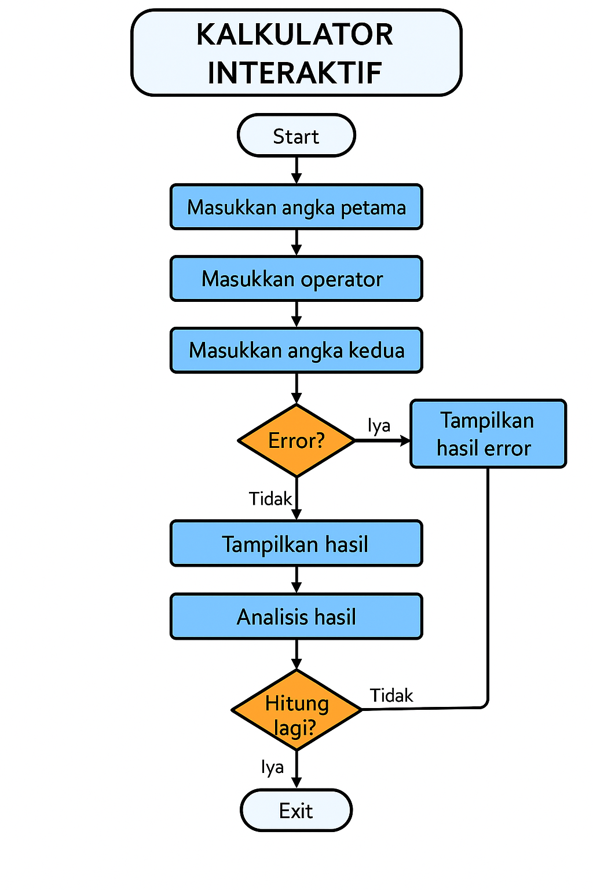
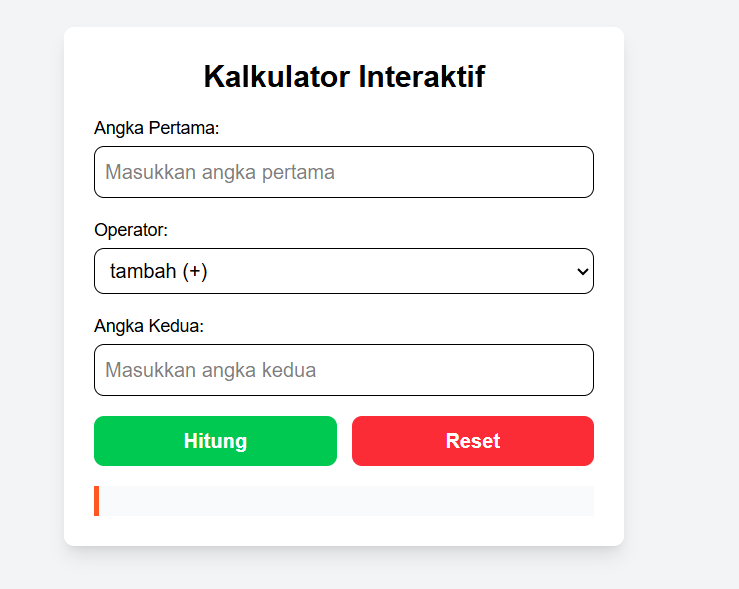

# 💻 Tech Company Landing Page

A modern and responsive **Tech Company Landing Page** built with **HTML5**, **Tailwind CSS**, and **JavaScript**.  
This project includes:

- 🚀 Fully responsive layout
- 🌗 Dark mode toggle with local storage preference
- 📩 Fully working contact form (EmailJS integration)
- 🧮 Interactive calculator page

---

## ✨ Features

### 🎨 Modern UI/UX

- Clean and minimal design with **Tailwind CSS**
- Mobile-first responsive layout
- Smooth color transition between **light mode** and **dark mode**

### 🌗 Dark Mode

- Automatic theme detection based on **system settings**
- User preference stored in **localStorage**
- Toggle between light/dark mode instantly

### 📩 Contact Form

- Fully functional **contact form** integrated with [EmailJS](https://www.emailjs.com/) (or your preferred backend)
- Validates user input before sending
- Responsive design for all devices

### 🧮 Calculator

- Standalone calculator page (`kalkulator.html`)
- Supports multiple operations:
  - Addition (+)
  - Subtraction (-)
  - Multiplication (\*)
  - Division (/)
  - Modulo (%)
  - Exponent (\*\*)
- Real-time result display

---

## 📂 Project Structure

```
📦 project-root
 ┣ 📂 assets          # Images, icons, and static assets
 ┣ 📂 src
 ┃ ┗ 📂 css
 ┃   ┣ 📜 input.css   # Tailwind CSS source
 ┃   ┗ 📜 output.css  # Compiled Tailwind CSS
 ┣ 📜 index.html      # Main landing page
 ┣ 📜 kalkulator.html # Calculator page
 ┣ 📜 package.json
 ┣ 📜 tailwind.config.js
 ┣ 📜 README.md
 ┗ 📜 .gitignore
```

---

## 🛠️ Installation & Setup

### 1️⃣ Clone Repository

```bash
git clone https://github.com/ezarelz/html-tailwind-js-wph.git
cd html-tailwind-js-wph
```

### 2️⃣ Install Dependencies

```bash
npm install
```

### 3️⃣ Run Tailwind CSS Watcher

```bash
npx tailwindcss -i ./src/css/input.css -o ./src/css/output.css --watch
```

### 4️⃣ Open in Browser

Simply open `index.html` in your preferred browser.

---

## 📬 Contact Form Setup

This project uses **EmailJS** for sending form submissions.  
You can configure your own service by:

1. Creating an account at [EmailJS](https://www.emailjs.com/)
2. Getting your **Service ID**, **Template ID**, and **Public Key**
3. Updating the form script in `index.html` with your credentials.

---

## 🧮 Calculator Page

Open `kalkulator.html` to use the interactive calculator.

---

## 📸 Screenshots

### Landing Page



### Calculator



---

## 📜 License

This project is licensed under the MIT License - feel free to use and modify as you like.

---

## 👨‍💻 Author

**Manggala Eleazar**
